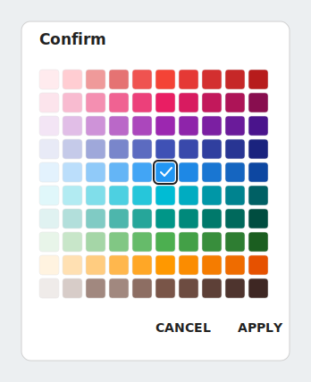
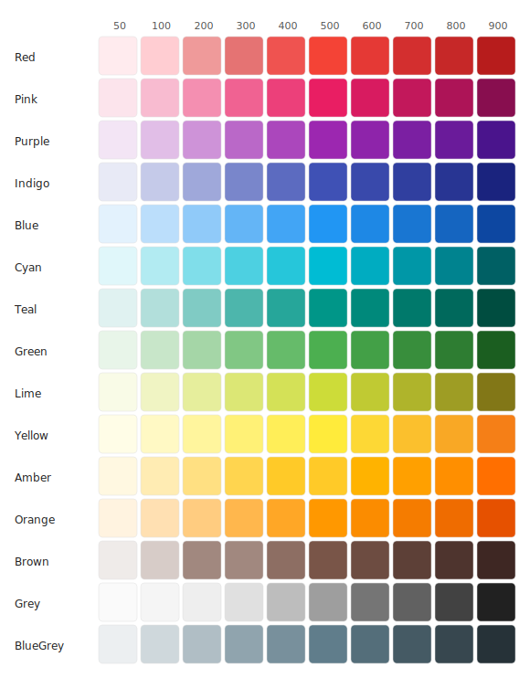

# ColorPicker

ColorPicker is a small Android library. It shows a Material Design color palette inside a dialog. The palette has 15 color families, each with 10 shades — 150 colors in total.

The user picks a color and taps **Apply**. Your app then receives two things: the selected color value and a matching theme style.

<p align="center">
  
</p>

## Features

- 🎨 15 Material color families, from Red to BlueGrey, in shades 50 to 900.
- 📱 A ready-to-use `DialogFragment`. One `show()` call is enough.
- ✅ One color at a time. The chosen swatch shows a check mark, and tapping it again clears the choice.
- 🔌 A single callback that hands you the color (`@ColorInt`) and a matching theme (`@StyleRes`).
- 🪶 Few dependencies: AppCompat, RecyclerView, and Material Components.

### Full palette

<p align="center">
  
</p>

## Requirements

| | |
|---|---|
| **minSdk** | 21 (Android 5.0 Lollipop) |
| **compileSdk / targetSdk** | 36 |
| **Language** | Java 11 |

The dialog uses Material Components, so the host activity's theme must extend a `Theme.MaterialComponents.*` (or `Theme.Material3.*`) theme.

## Installation

The library is published through [JitPack](https://jitpack.io). Setup takes two steps.

**Step 1 — Add the JitPack repository.** Put this in your root `settings.gradle` (or `build.gradle`):

```gradle
dependencyResolutionManagement {
    repositories {
        google()
        mavenCentral()
        maven { url 'https://jitpack.io' }
    }
}
```

**Step 2 — Add the dependency.** Put this in your app module's `build.gradle`:

```gradle
dependencies {
    implementation 'com.github.florianbehrend.ColorPicker:Color-Picker:v1.0'
}
```

Use `v1.0` or any newer tag from the [releases page](https://github.com/florianbehrend/ColorPicker/releases).

## Usage

Open the picker and handle the user's choice:

```java
ColorPicker picker = ColorPicker.newInstance();
picker.setOnColorSelectedListener((themeStyleRes, primaryColor) -> {
    // primaryColor : the chosen color as an ARGB int (@ColorInt)
    // themeStyleRes: a theme tied to that color, e.g. R.style.Blue500 (@StyleRes)
    toolbar.setBackgroundColor(primaryColor);
});
picker.show(getSupportFragmentManager(), "color_picker");
```

The callback runs only when the user taps **Apply** with a color selected. Tapping **Cancel**, or tapping Apply with nothing selected, does nothing.

### Applying the selected theme

Every swatch has a matching **ThemeOverlay** named `R.style.<Family><Shade>`, for example `R.style.Blue700`. Each overlay has an empty parent and sets `colorPrimary`, `colorPrimaryDark`, `colorAccent`, `textColor`, and a custom `transparent` attribute. Because the parent is empty, applying it with `applyStyle` layers those colors on top of your existing base theme — works on both AppCompat and Material 3 hosts without dragging in a parent theme.

Apply the theme before your UI is drawn:

```java
@Override
public void onColorSelected(int themeStyleRes, int primaryColor) {
    // Save the choice first, then apply the theme and rebuild the screen.
    getTheme().applyStyle(themeStyleRes, true);
    recreate();
}
```

### Keeping the choice after a rotation

`ColorPicker` is a `DialogFragment`, so Android restores it automatically when the screen rotates. The listener, however, is not restored. Re-attach it in `onCreate` so your callback keeps working:

```java
ColorPicker existing =
        (ColorPicker) getSupportFragmentManager().findFragmentByTag("color_picker");
if (existing != null) {
    existing.setOnColorSelectedListener(this);
}
```

## Sample app

The `:app` module is a working demo. Build and install it like this:

```bash
./gradlew :app:installDebug
```

## Building from source

```bash
./gradlew :Color-Picker:assembleRelease   # build the AAR
./gradlew test                             # run the unit tests
```

You need **JDK 17 or newer**, because Android Gradle Plugin 9.x requires it. Point `JAVA_HOME` at a JDK 17 — for example, the one that ships with Android Studio.

## API reference

| Member | What it does |
|---|---|
| `ColorPicker.newInstance()` | Creates a new picker. |
| `setOnColorSelectedListener(listener)` | Sets the callback that runs on Apply. |
| `getColors()` | Returns the palette as `{colorResId, styleResId}` pairs, in display order. |
| `OnColorSelectedListener.onColorSelected(themeStyleRes, primaryColor)` | Runs on Apply. Gives you the theme (`@StyleRes`) and the color (`@ColorInt`). |

## License

See [LICENSE](LICENSE) if it exists. If not, add one before you publish.
